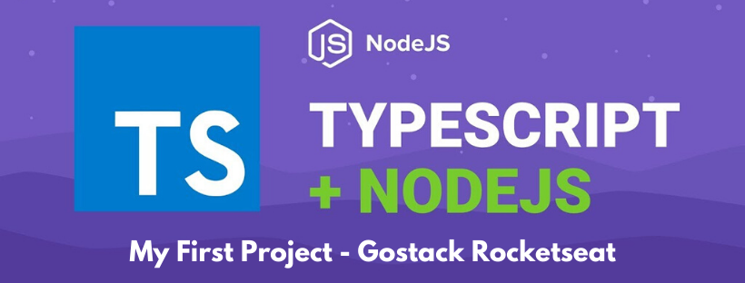

## My First Project with Node.js + TypeScript - GoStack Rocketseat

Studying project structure and patterns with Node.js, Typescript and Express - Rocketseat GoStack

<p align="center">
  
</p>

Below is the link to the Skylab course platform, where this project is part of the GoStack Rocketseat.
https://skylab.rocketseat.com.br/

### Application developed with Node.js, Typescript and Express:

### To install the application:

This is a [Node.js](https://nodejs.org/en/) project challenge with uses Typescript and Express.js. For install this project after clone, use next steps:

```bash
$ yarn
```
### To run the application:

After complete instalation, run the aplication with command:

```bash
$ yarn dev:server
```
View this aplication at: http://localhost:3333

<!-- ### A partial view of the application code in Visual Studio Code::

<p align="center">
  
</p> -->

<!-- ### A partial view of the application's routes in the Insomnia environment::

<p align="center">
  
</p> -->

### Learn more about me. Hire!

  https://www.linkedin.com/in/alexgomesnet/

### License:

  [MIT](LICENSE)
